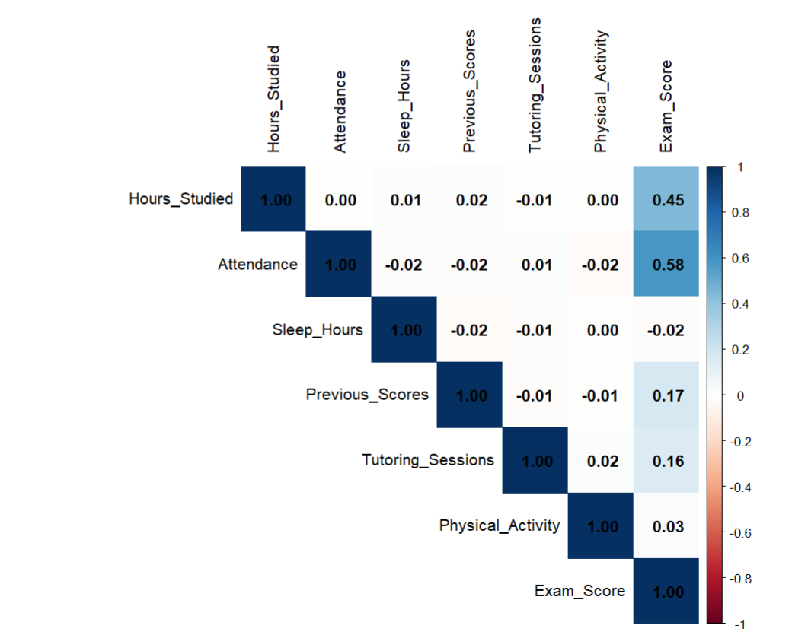

# Student Performance Analytics

## Overview

This project analyzes factors influencing student academic performance using statistical modeling and data visualization in R.

**Tools:** R, Regression Analysis, Logistic Regression, Cluster Analysis, Data Visualization

## Dataset

- **Source:** Kaggle
- **Observations:** 6,607 students (6,378 after cleaning)
- **Variables:** 20 (7 numerical, 13 categorical)

## Methodology

- Data Cleaning
- Exploratory Data Analysis (EDA)
- Descriptive Statistics
- Correlation Analysis
- Linear Regression
- Logistic Regression
- Cluster Analysis
- Model Diagnostics

## Key Findings

- Attendance is the strongest predictor of exam performance.
- Hours studied positively influence academic performance.
- Tutoring sessions significantly increase the probability of passing.
- The logistic regression model achieved an AUC of 0.9446.
- Cluster analysis identified three distinct student groups.

- ## Repository Structure

```
Student-Performance-Analytics/
│── code/
│── data/
│── images/
│── presentation/
│── report/
│── README.md
```

## Skills Demonstrated

- R Programming
- Data Cleaning
- Data Visualization
- Statistical Analysis
- Linear Regression
- Logistic Regression
- Cluster Analysis
- Predictive Analytics
- Educational Data Mining

- 
